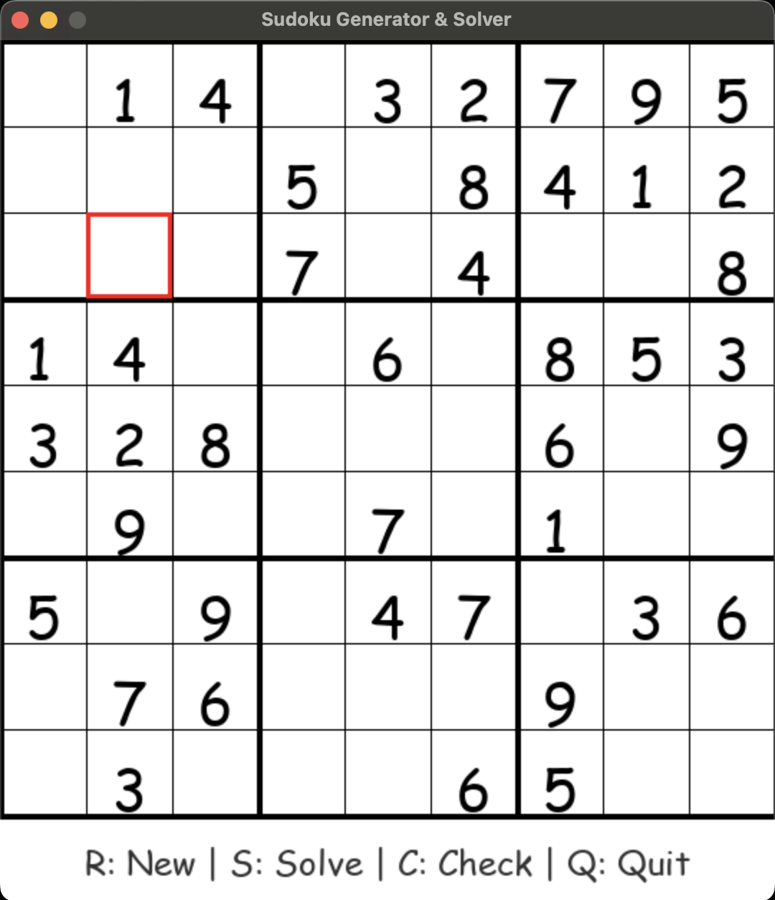
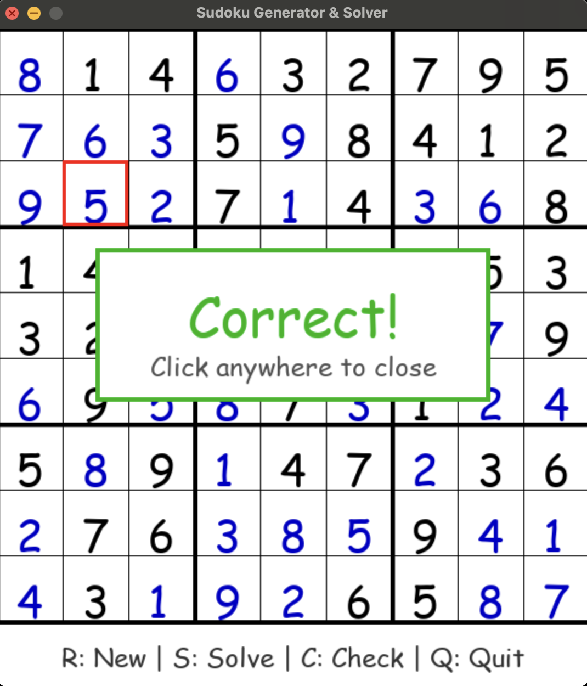
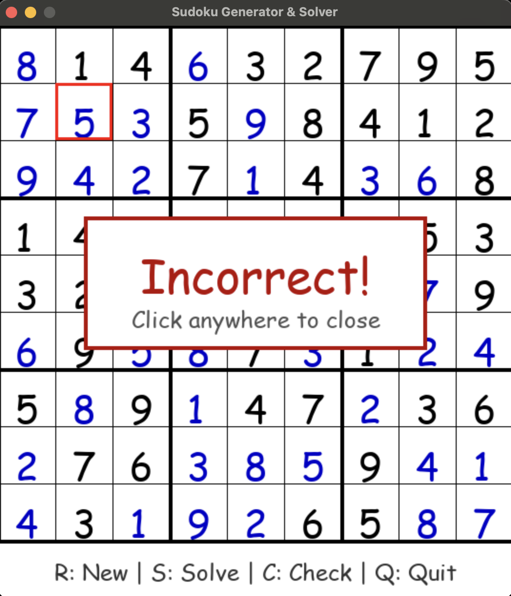

# Inferix Sudoku

A clean, fully playable Sudoku game built in Python using `pygame`. Each time you launch the game, a new randomly generated and solvable puzzle is presented. You can interactively fill in values, auto-solve, or check your solution with a centered popup response.

## 🎮 Features

- ✅ **Random Sudoku generation** each run
- 🧠 **Backtracking-based solver**
- 🎯 **Manual input** via mouse and keyboard
- 🟢 **Check solution** with a popup message (Correct / Incorrect)
- ⚡ **Auto-solve** option (instantly fills correct solution)
- ✏️ **Grid selection & key input**
- 🎨 **Fonts and layout auto-scaled to fit perfectly**
- 🔁 **Reset (new puzzle) anytime**

---

## 🕹️ Controls

_|_______________________________________|_
 | Key       | Action                    |
 |-----------|---------------------------|
 | Click     | Select a cell             |
 | 1–9       | Input a digit             |
 | 0 / Delete / Backspace | Clear cell   |
 | `R`       | Generate new puzzle       |
 | `S`       | Auto-solve current puzzle |
 | `C`       | Check your solution       |
 | `Q`       | Quit the game             |
-|---------------------------------------|-

---

## 🧩 Gameplay Preview

[]

- Green "Correct!" popup appears if your solution is right.
[]

- Red "Incorrect!" popup if any rule is broken.
[]

---

## 🚀 Getting Started...

### Prerequisites

- Python 3.x
- `pygame` library

### Installation

```bash
pip install pygame